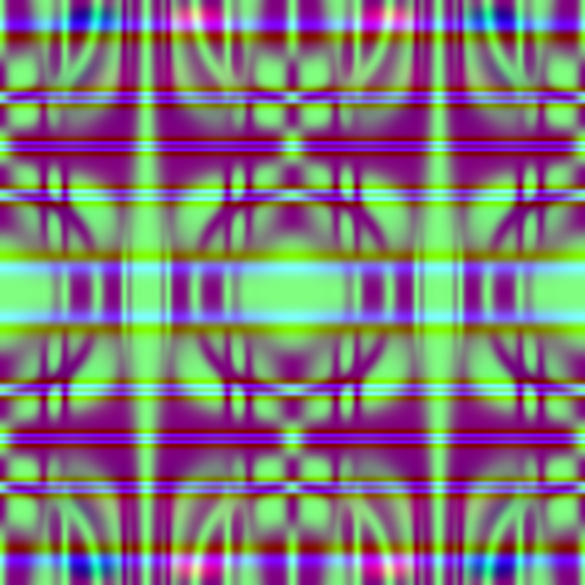
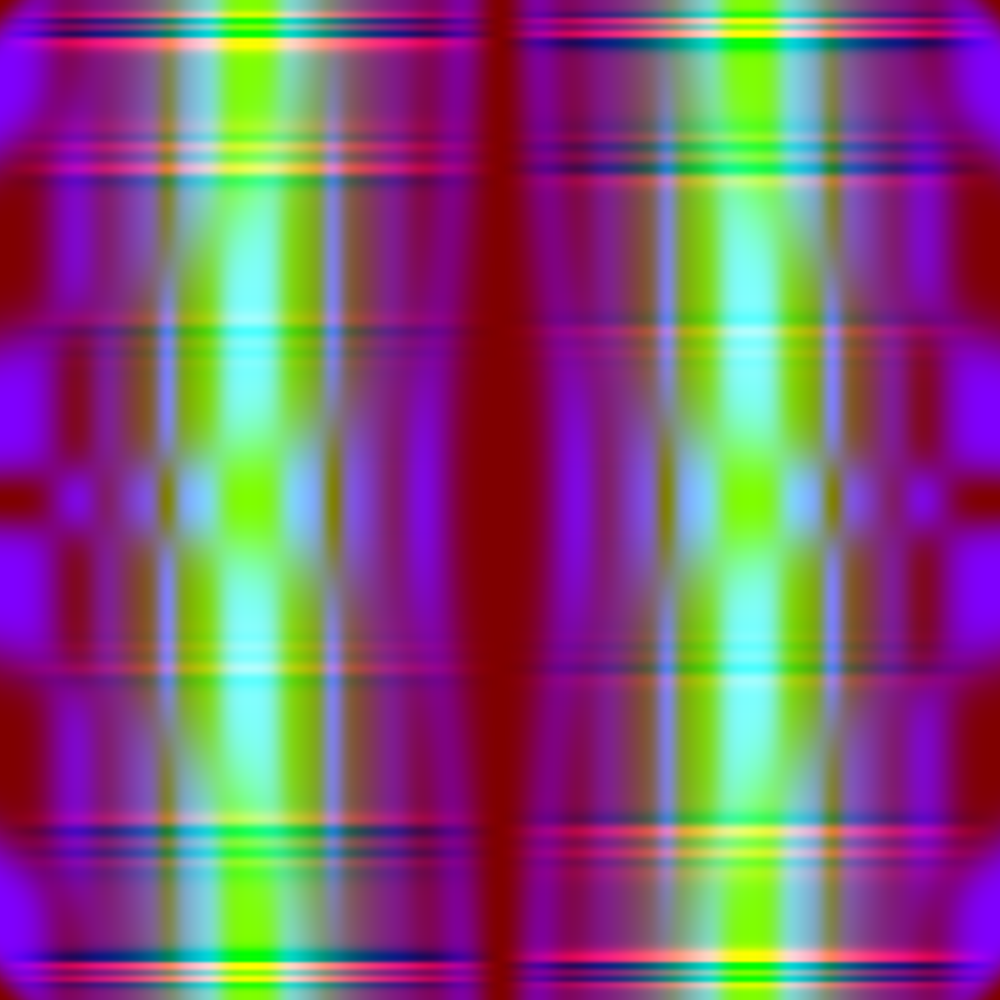

  

# Forelsket

Math Equations and Formulas Used: 
1. [Mish Activation Function](https://github.com/digantamisra98/Mish)
2. Reciprocal of Mish Activation Function
3. Natural Logarithm of input
4. Sum of Sine and Cosine wave of input

## Generated Samples:

### Fractal Designs: 

  
   

  
   

  
   

### Psychedelic Artworks:

  
   

